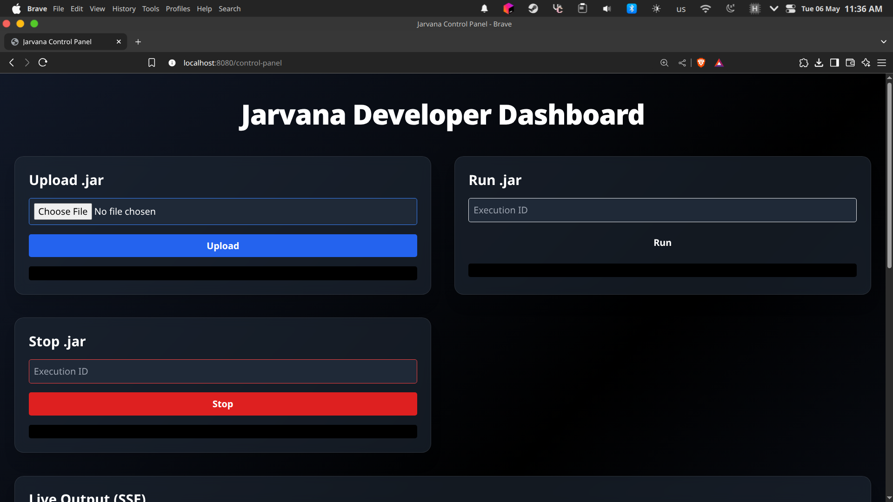

# 🚀 Jarvana – Web-Based Java Jar Execution Platform

**Jarvana** is a sleek control panel that lets you upload, run, stop, and monitor `.jar` files directly from a web interface — no terminal required.

---

## 🎯 Purpose

Jarvana was created to eliminate the need for terminal-based commands when working with Java applications. Whether you’re on mobile, desktop, or a restricted environment, you can now start your Java apps with a single click.

---

## 🖼 Frontend Preview

> 

---

## 🛠 Tech Stack

| Layer        | Technology                      |
|--------------|----------------------------------|
| Backend      | Kotlin + Spring Boot             |
| Frontend     | HTML + TailwindCSS               |
| Execution    | Java ProcessBuilder (Native)     |
| Live Output  | Server-Sent Events (SSE)         |
| Database     | H2 In-Memory Database            |

---

## 📡 API Endpoints

### 🔼 Jar Management

| Endpoint              | Method   | Description                          |
|-----------------------|----------|--------------------------------------|
| `/jars/upload`        | `POST`   | Upload a `.jar` file                 |
| `/jars/delete/{id}`   | `DELETE` | Delete a specific `.jar`             |
| `/jars/delete/all`    | `DELETE` | Delete all uploaded `.jar` files     |

### 🏃 Execution Control

| Endpoint            | Method   | Description                          |
|---------------------|----------|--------------------------------------|
| `/exec/{id}`        | `GET`    | Start a `.jar` application           |
| `/exec/stop/{id}`   | `DELETE` | Stop a running application           |
| `/exec/stream/{id}` | `GET`    | Live terminal output via SSE         |

### 📄 Metadata Access

| Endpoint              | Method   | Description                          |
|-----------------------|----------|--------------------------------------|
| `/info/{id}`          | `GET`    | Get metadata for a specific `.jar`   |
| `/info/all`           | `GET`    | Get metadata for all `.jar` files    |

---

## ▶️ Getting Started

After building and running the application:

🔗 Open your browser and navigate to:  
**[http://localhost:8080](http://localhost:8080)**

This will take you directly to the **Jarvana Dashboard**, where you can start uploading and executing `.jar` files.

---

## 👨‍💻 About This Project

Jarvana is an open-source utility developed for Java developers who want a graphical alternative to CLI-based `.jar` execution.  
The frontend was prototyped with the help of ChatGPT, while the backend is fully written in Kotlin using the Spring ecosystem.

---

## 🧭 Roadmap

- [ ] Add authentication (JWT)
- [ ] Save execution logs
- [ ] WebSocket-based bi-directional output
- [ ] Docker-friendly deployment support

---

## 🙌 Contributing

1. Fork this repository
2. Make your changes
3. Open a Pull Request

Issues and feature requests are always welcome!

📫 Contact: darkrange6@gmail.com

---

## 📄 License

MIT License © 2025 [Jarvana Project](LICENSE)
