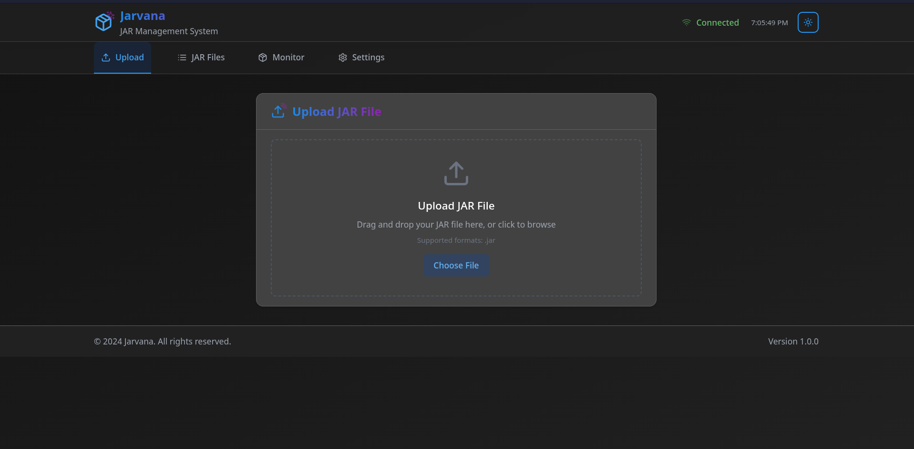

# 🚀 Jarvana – Web-Based Java Jar Execution Platform


---

## Table of Contents
- [About Jarvana](#about-jarvana)
- [Purpose](#purpose)
- [Tech Stack](#tech-stack)
- [API Endpoints](#api-endpoints)
- [Frontend Features & UX](#frontend-features--ux)
- [Getting Started](#getting-started)
- [Prerequisites](#prerequisites)
- [Contributing](#contributing)
- [License](#license)
- [Changelog](#changelog)

---

## About Jarvana

**Jarvana** is a sleek and intuitive web-based control panel that allows you to upload, run, stop, and monitor Java `.jar` files without ever needing to touch the terminal. Whether you are on mobile, desktop, or a restricted environment, you can start and control your Java applications with just a click.

The backend is fully written in Kotlin using Spring Boot, while the frontend is built with React, TypeScript, and Tailwind CSS.  
The frontend was expertly **designed and developed by Cursor**, focusing on a modern, responsive, and user-friendly interface.

---

## Purpose

Jarvana was created to remove the need for command-line interaction when managing Java applications. It simplifies running `.jar` files and provides a centralized dashboard for execution control and real-time output monitoring.

---

## Tech Stack

| Layer          | Technology                       |
|----------------|---------------------------------|
| Backend        | Kotlin + Spring Boot            |
| Frontend       | React + TypeScript + TailwindCSS|
| Execution      | Java ProcessBuilder (Native)    |
| Live Output    | Server-Sent Events (SSE)        |
| Database       | H2 In-Memory Database           |
| Build Tool     | Gradle                         |
| API Docs       | OpenAPI / Swagger               |

---

## API Endpoints

### Jar Management

| Endpoint              | Method   | Description                       |
|-----------------------|----------|---------------------------------|
| `/jars/upload`        | `POST`   | Upload a `.jar` file             |
| `/jars/delete/{id}`   | `DELETE` | Delete a specific `.jar` file    |
| `/jars/delete/all`    | `DELETE` | Delete all uploaded `.jar` files |
| `/jars/download/{id}` | `GET`    | Download a specific `.jar` file  |

### Execution Control

| Endpoint              | Method   | Description                        |
|-----------------------|----------|----------------------------------|
| `/exec/{id}`          | `GET`    | Start a `.jar` application        |
| `/exec/stop/{id}`     | `DELETE` | Stop a running application        |
| `/exec/stream/{id}`   | `GET`    | Stream live terminal output (SSE) |

### Metadata Access

| Endpoint              | Method   | Description                        |
|-----------------------|----------|----------------------------------|
| `/info/{id}`          | `GET`    | Get metadata for a specific `.jar` file |
| `/info/all`           | `GET`    | Get metadata for all `.jar` files with pagination |

**Pagination parameters for `/info/all`:**

- `size` (default: 10) - Items per page  
- `page` (default: 0) - Page number (0-based)  
- `direction` (default: ASC) - Sort order (ASC or DESC)  
- `properties` (default: id) - Property to sort by  

---

## Frontend Features & UX

The frontend of Jarvana was **designed and developed by Cursor**, delivering a modern, clean, and highly interactive user experience with the following highlights:

- **File Upload**  
  Drag & drop or select `.jar` files easily with intuitive controls.

- **Run & Stop Controls**  
  Start or stop any uploaded `.jar` application with a single click.

- **Live Console Output**  
  Real-time streaming of application logs via Server-Sent Events (SSE) without page reload.

- **Bulk Actions**  
  Select multiple `.jar` files for batch deletion or downloading.

- **Advanced Pagination & Sorting**  
  Efficiently browse, sort, and filter your uploaded `.jar` files.

- **Responsive Design**  
  Fully optimized for desktop, tablet, and mobile devices using Tailwind CSS.

- **Notifications & Status Indicators**  
  Receive instant feedback on operations with toast notifications and live status badges.

- **Keyboard Shortcuts & Accessibility**  
  Speed up workflows with keyboard navigation and ARIA-compliant components.

---

## Getting Started

### Quick Start

Clone the repository and run the backend server:

```bash
git clone https://github.com/range79/Jarvana
cd Jarvana

# Start backend server
./gradlew bootRun
````


Open your browser and access:

* Backend API & Dashboard: [http://localhost:8080](http://localhost:8080)
* Frontend UI: [http://localhost:3000](http://localhost:3000)

---

### Manual Setup

If you want to run frontend and backend separately:

```bash

./gradlew bootRun
cd frontend
npm install
npm run dev
```

---

## Prerequisites

* **Java 17+** (to run Java `.jar` files)
* **Node.js 16+** (for frontend development)
* **npm** (comes with Node.js)

---

## Contributing

We welcome contributions! To contribute:

1. Fork the repository
2. Create your feature branch (`git checkout -b feature/your-feature`)
3. Commit your changes (`git commit -m 'Add your feature'`)
4. Push to your branch (`git push origin feature/your-feature`)
5. Open a Pull Request

Feel free to open issues and suggest features.

---

## Contact

📫 Email: [darkrange6@gmail.com](mailto:darkrange6@gmail.com)

---

## License

This project is licensed under the **MIT License** © 2025 [Jarvana Project](LICENSE)

---

## Changelog

See the [CHANGELOG.md](CHANGELOG.md) file for detailed version history.

---
## Dark mode frontend Preview



---
## Light mode frontend Preview

